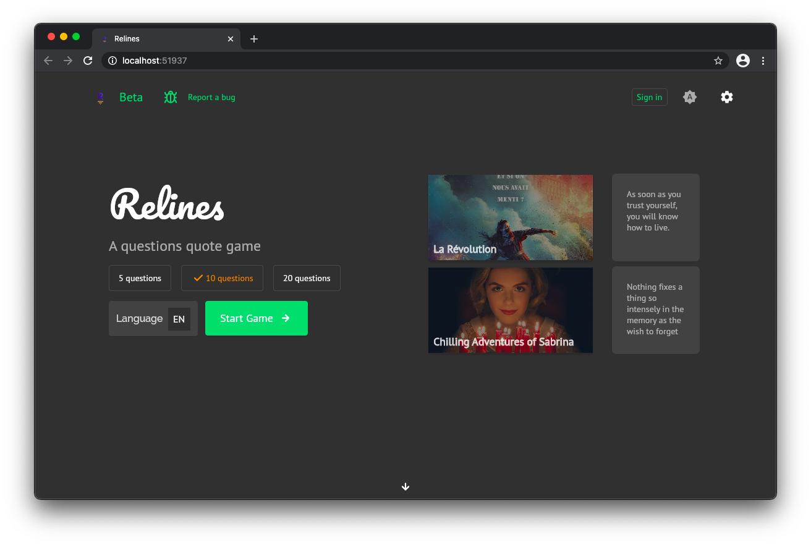

<p align="middle">

</p>

<p align="middle">
Relines is a quotes game based on <a href="https://fig.style">fig.style</a> <a href="https://dev.fig.style">API</a>.
</p>

<p align="middle">

</p>


# Status


# Download
<!-- 
<span style="margin-right: 10px;">
  <a href="https://apps.apple.com/us/app/out-of-context/id1516117110?ls=1">
    
  </a>
</span>

<span style="margin-right: 10px;">
  <a href="https://play.google.com/store/apps/details?id=com.outofcontext.app">
    
  </a>
</span> -->

<span>
  <a href="https://relines.fig.style">
    
  </a>
</span>
<br>
<br>
<br>

# Game

The goal is to score the maximum of points for a limited amount of questions.

For each question, you must guess either the quote's author or the quote's reference. The type randomly alternate.

Each good answer gives you 10 points (+10). One mistake makes you loose 5 points (-5). To skip a  question, you need to give 1 point (-1). You can have a negative total of points.

A party has a maximum of 5, 10 or 20 questions.

# Develop

> Prereq: make sure you've [Flutter](https://flutter.dev) installed.

If you want to run the app locally:

* Clone the app `gh repo clone rootasjey/relines`
* Navigate to the created folder `cd relines`
* Switch branch to vercel: `git checkout vercel` (branch without Firebase)
* Get packages: `flutter pub get`
* Create an account, an app, & get an API key on [dev.fig.style](https://dev.fig.style)
* Copy the key to `assets/config/base.json`

```json
{
  "apikey": "Paste the key here"
}
```

* Run the app `flutter run --debug -d chrome`
# Contribute

You can contribute by suggesting a feature, reporting a bug or giving your feedback. You can also clone the repo locally and have fun with the code.

# License

Mozilla Public License 2.0.

Please read the [LICENSE](./LICENSE) for more information.

Please [ask](mailto:github@fig.style) if you have any doubt.

# Screenshots

<p>

</p>
